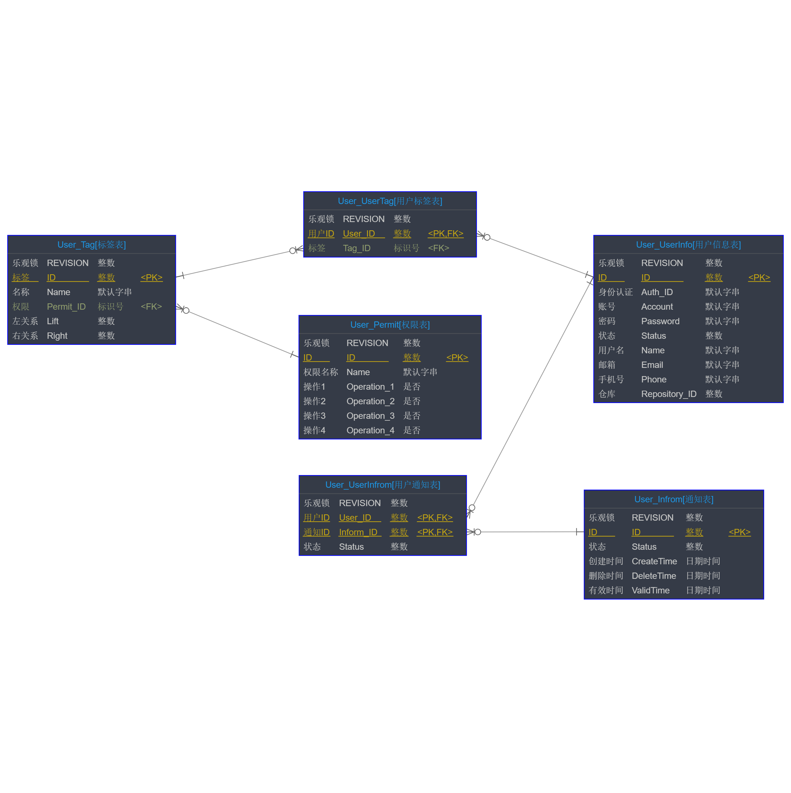
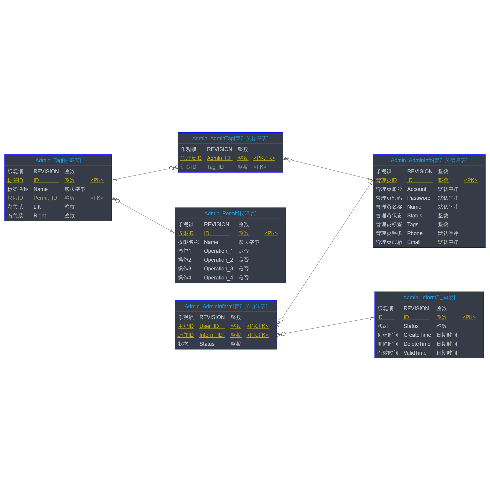
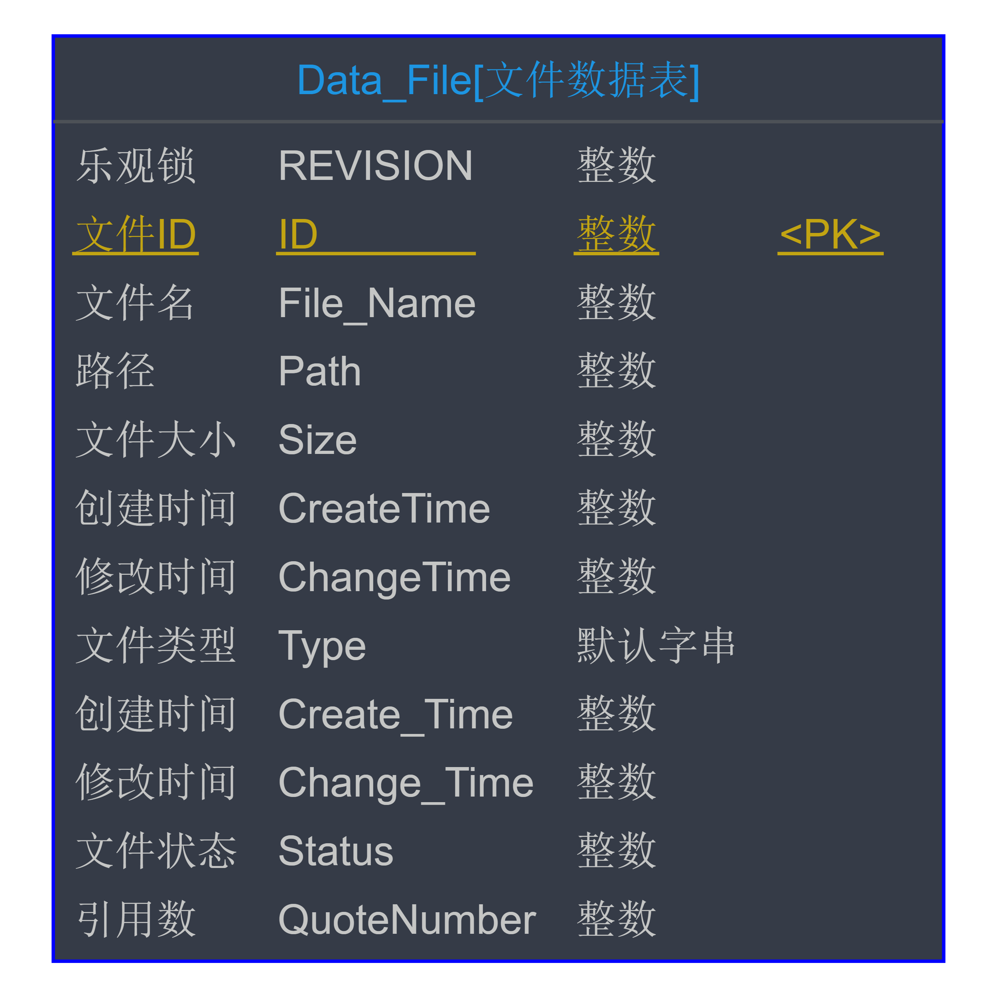
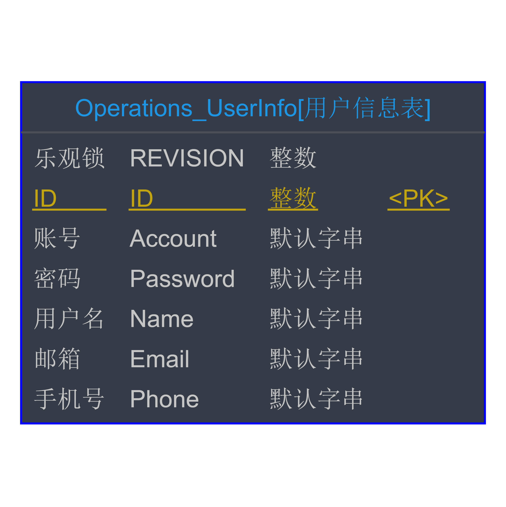

## 3.5 系统体系结构设计 -- 待定

#### 3.5.1.1 用户模块

#### 3.5.1.2 管理员模块

#### 3.5.1.3 数据模块

#### 3.5.1.4 群组模块

好友分组数据格式

~~~json
user_id:{
    group_id:{
        group_name:"分组1",
        friends:[friend,friend]
    },
    group_id:{
        group_name:"分组2",
        friends:[friend,friend]
    },
}
friend:{
    name:"好友1",
    remark_name:"张三",
    id:"40bd001563085fc35165329ea1ff5c5ecbdbbeef",
    chat_id:"40bd001563085fc35165329ea1ff5c5ecbdbbeef"
}
~~~

群组数据格式

~~~json
chat_group_id:{
	name:"聊天群1",
    members:[member,member]
    chat_id:"40bd001563085fc35165329ea1ff5c5ecbdbbeef"
}
member:{
    name:"群员1",
    remark_name:"张三",
    id:"40bd001563085fc35165329ea1ff5c5ecbdbbeef"
}
~~~

聊天记录数据

~~~json
chat_id:{
    messages:[]
}
message:{
    user_id:"",
    user_name:"",
    user_remark_name:"",
    content:"",
    timestamp:""
}
~~~

#### 3.5.1.5 运维模块

#### 3.5.1.6 仓库模块

文件仓库数据格式

~~~json
repository:{
    id:"40bd001563085fc35165329ea1ff5c5ecbdbbeef",
    status:1,
    useSize:502,
    repoSize:1073741824,
    directory:{
        path:"/",
        depth:0,
        folders:{
            测试文件夹:{
                name:"测试文件夹",
                path:"/测试文件夹/",
                depth:1,
                size:0,
                createTime:"0000/00/00-00:00:00",
                changeTime:"0000/00/00-00:00:00",
                status:1,
                folders:null,
                files:null
            }
        },
        files:{
            测试文件:{
                name:"测试文件",
                id:"40bd001563085fc35165329ea1ff5c5ecbdbbeef",
                path:"/测试文件.txt"
                type:"txt",
                size:251,
                status:1,
                createTime:"0000/00/00-00:00:00",
                changeTime:"0000/00/00-00:00:00"
            }
        },
        recycleBin:{
			useSize:251,
            files:[{
                name:"测试文件",
                id:"40bd001563085fc35165329ea1ff5c5ecbdbbeef",
                path:"/测试文件.txt"
                type:"txt",
                size:251,
                status:0,
                createTime:"0000/00/00-00:00:00",
                changeTime:"0000/00/00-00:00:00"
            }],
            folders:[{
                name:"测试文件夹",
                path:"/测试文件夹/",
                depth:1,
                size:0,
                createTime:"0000/00/00-00:00:00",
                changeTime:"0000/00/00-00:00:00",
                status:0,
                folders:null,
                files:null
            }]
        }
    }
}
~~~

#### 3.5.1.7 分享模块

分享数据格式

~~~json
share:{
    id:"fc35165329ea1ff5c5ecbdbbeef40bd001563085",
    userID:"ea1ff5c5ecbdbbeef40bd56308500fc351653291",
    status:1,
    type:1,
    password:"1234",
    File:{//也可以是Floder
        name:"测试文件",
        id:"40bd001563085fc35165329ea1ff5c5ecbdbbeef",
        path:"/测试文件.txt"
        type:"txt",
        size:251,
        status:0,
        createTime:"0000/00/00-00:00:00",
        changeTime:"0000/00/00-00:00:00"
    },
    createTime:"",
    changeTime:"",
    saveID:[“ea1ff5c5ecbdbbeef40bd56308500fc351653291”，“fc35165329ea1ff5c5ecbdbbeef40bd001563085”]
}
~~~

### 3.5.2 关系模式

#### 3.5.2.1 用户模块

| 名称       | 代码             | 备注 |
| ---------- | ---------------- | ---- |
| 用户信息表 | User\_UserInfo |  |
| 用户标签表 | User\_UserTag |  |
| 标签表 | User\_Tag |  |
| 权限表 | User\_Permit |  |
| 通知表 | User\_Infrom |  |
| 用户通知表 | User\_UserInfrom |  |

#### 3.5.2.2 管理员模块

| 名称         | 代码               | 备注 |
| ------------ | ------------------ | ---- |
| 管理员信息表 | Admin\_AdminInfo |  |
| 管理员标签表 | Admin\_AdminTag |  |
| 标签表 | Admin\_Tag |  |
| 权限表 | Admin\_Permit |  |
| 通知表 | Admin\_Inform |  |
| 管理员通知表 | Admin\_AdminInform |  |

#### 3.5.2.3 数据模块

| 名称         | 代码                | 备注 |
| ------------ | ------------------- | ---- |
| 文件数据表 | Data\_File |  |

#### 3.5.2.4 运维模块

| 名称   | 代码         | 备注 |
| ------ | ------------ | ---- |
| 用户信息表 | Operations\_UserInfo |  |

### 3.5.3 表的设计

#### 3.5.3.1 用户模块

##### 3.5.3.1.1 用户信息表

| 代码          | 名称   | 数据类型(MYSQL) | 主键 | 备注 |
| ------------- | ------ | --------------- | ---- | ---- |
| REVISION | 乐观锁 | INT |  |  |
| ID | ID | INT | √ |  |
| Auth\_ID | 身份认证 | VARCHAR(32) |  |  |
| Account | 账号 | VARCHAR(32) |  |  |
| Password | 密码 | VARCHAR(32) |  |  |
| Status | 状态 | INT |  |  |
| Name | 用户名 | VARCHAR(32) |  |  |
| Email | 邮箱 | VARCHAR(32) |  |  |
| Phone | 手机号 | VARCHAR(32) |  |  |
| Repository\_ID | 仓库 | INT |  |  |

##### 3.5.3.1.2 用户标签表

| 代码     | 名称   | 数据类型(MYSQL) | 主键 | 备注 |
| -------- | ------ | --------------- | ---- | ---- |
| REVISION | 乐观锁 | INT |  |  |
| User\_ID | 用户ID | INT | √ |  |
| Tag\_ID | 标签 | VARCHAR(32) |  |  |

##### 3.5.3.1.3 标签表

| 代码      | 名称   | 数据类型(MYSQL) | 主键 | 备注 |
| --------- | ------ | --------------- | ---- | ---- |
| REVISION | 乐观锁 | INT |  |  |
| ID | 标签 | INT | √ |  |
| Name | 名称 | VARCHAR(32) |  |  |
| Permit\_ID | 权限 | VARCHAR(32) |  |  |
| Lift | 左关系 | INT |  |  |
| Right | 右关系 | INT |  |  |

##### 3.5.3.1.4 权限表

| 代码        | 名称     | 数据类型(MYSQL) | 主键 | 备注 |
| ----------- | -------- | --------------- | ---- | ---- |
| REVISION | 乐观锁 | INT |  |  |
| ID | ID | INT | √ |  |
| Name | 权限名称 | VARCHAR(32) |  |  |
| Operation\_1 | 操作1 | VARCHAR(1) |  |  |
| Operation\_2 | 操作2 | VARCHAR(1) |  |  |
| Operation\_3 | 操作3 | VARCHAR(1) |  |  |
| Operation\_4 | 操作4 | VARCHAR(1) |  |  |
##### 3.5.3.1.5 通知表
| 代码 | 名称 | 数据类型(MYSQL) | 主键 | 备注 |
| ------------ | ------------ | ------------ | ------------ | ------------ |
| REVISION | 乐观锁 | INT |  |  |
| ID | ID | INT | √ |  |
| Status | 状态 | INT |  |  |
| CreateTime | 创建时间 | DATETIME |  |  |
| DeleteTime | 删除时间 | DATETIME |  |  |
| ValidTime | 有效时间 | DATETIME |  |  |
##### 3.5.3.1.6 用户通知表
| 代码 | 名称 | 数据类型(MYSQL) | 主键 | 备注 |
| ------------ | ------------ | ------------ | ------------ | ------------ |
| REVISION | 乐观锁 | INT |  |  |
| User\_ID | 用户ID | INT | √ |  |
| Inform\_ID | 通知ID | INT | √ |  |
| Status | 状态 | INT |  |  |
#### 3.5.3.2 管理员模块

##### 3.5.3.2.1 管理员信息表

| 代码     | 名称       | 数据类型(MYSQL) | 主键 | 备注 |
| -------- | ---------- | --------------- | ---- | ---- |
| REVISION | 乐观锁 | INT |  |  |
| ID | 管理员ID | INT | √ |  |
| Account | 管理员账号 | VARCHAR(32) |  |  |
| Password | 管理员密码 | VARCHAR(32) |  |  |
| Name | 管理员名称 | VARCHAR(32) |  |  |
| Status | 管理员状态 | INT |  |  |
| Tags | 管理员标签 | INT |  |  |
| Phone | 管理员手机 | VARCHAR(32) |  |  |
| Email | 管理员邮箱 | VARCHAR(32) |  |  |

##### 3.5.3.2.2 管理员标签表

| 代码         | 名称     | 数据类型(MYSQL) | 主键 | 备注 |
| ------------ | -------- | --------------- | ---- | ---- |
| REVISION | 乐观锁 | INT |  |  |
| Admin\_ID | 管理员ID | INT | √ |  |
| Tag\_ID | 标签ID | INT |  |  |

##### 3.5.3.2.3 标签表

| 代码      | 名称   | 数据类型(MYSQL) | 主键 | 备注 |
| --------- | ------ | --------------- | ---- | ---- |
| REVISION | 乐观锁 | INT |  |  |
| ID | 标签ID | INT | √ |  |
| Name | 标签名称 | VARCHAR(32) |  |  |
| Permit\_ID | 权限ID | INT |  |  |
| Lift | 左关系 | INT |  |  |
| Right | 右关系 | INT |  |  |

##### 3.5.3.2.4 权限表

| 代码        | 名称   | 数据类型(MYSQL) | 主键 | 备注 |
| ----------- | ------ | --------------- | ---- | ---- |
| REVISION | 乐观锁 | INT |  |  |
| ID | 权限ID | INT | √ |  |
| Name | 权限名称 | VARCHAR(32) |  |  |
| Operation\_1 | 操作1 | VARCHAR(1) |  |  |
| Operation\_2 | 操作2 | VARCHAR(1) |  |  |
| Operation\_3 | 操作3 | VARCHAR(1) |  |  |
| Operation\_4 | 操作4 | VARCHAR(1) |  |  |

##### 3.5.3.2.5 通知表
| 代码 | 名称 | 数据类型(MYSQL) | 主键 | 备注 |
| ------------ | ------------ | ------------ | ------------ | ------------ |
| REVISION | 乐观锁 | INT |  |  |
| ID | ID | INT | √ |  |
| Status | 状态 | INT |  |  |
| CreateTime | 创建时间 | DATETIME |  |  |
| DeleteTime | 删除时间 | DATETIME |  |  |
| ValidTime | 有效时间 | DATETIME |  |  |
##### 3.5.3.2.6 管理员通知表
| 代码 | 名称 | 数据类型(MYSQL) | 主键 | 备注 |
| ------------ | ------------ | ------------ | ------------ | ------------ |
| REVISION | 乐观锁 | INT |  |  |
| User\_ID | 用户ID | INT | √ |  |
| Inform\_ID | 通知ID | INT | √ |  |
| Status | 状态 | INT |  |  |
#### 3.5.3.3 数据模块

##### 3.5.3.3.1 文件数据表
| 代码 | 名称 | 数据类型(MYSQL) | 主键 | 备注 |
| ------------ | ------------ | ------------ | ------------ | ------------ |
| REVISION | 乐观锁 | INT |  |  |
| ID | 文件ID | INT | √ |  |
| File\_Name | 文件名 | INT |  |  |
| Path | 路径 | INT |  |  |
| Size | 文件大小 | INT |  |  |
| CreateTime | 创建时间 | INT |  |  |
| ChangeTime | 修改时间 | INT |  |  |
| Type | 文件类型 | VARCHAR(32) |  |  |
| Create\_Time | 创建时间 | INT |  |  |
| Change\_Time | 修改时间 | INT |  |  |
| Status | 文件状态 | INT |  |  |
| QuoteNumber | 引用数 | INT |  |  |

#### 3.5.3.4 运维模块

##### 3.5.3.4.1 用户信息表

| 代码 | 名称 | 数据类型(MYSQL) | 主键 | 备注 |
| ------------ | ------------ | ------------ | ------------ | ------------ |
| REVISION | 乐观锁 | INT |  |  |
| ID | ID | INT | √ |  |
| Account | 账号 | VARCHAR(32) |  |  |
| Password | 密码 | VARCHAR(32) |  |  |
| Name | 用户名 | VARCHAR(32) |  |  |
| Email | 邮箱 | VARCHAR(32) |  |  |
| Phone | 手机号 | VARCHAR(32) |  |  |