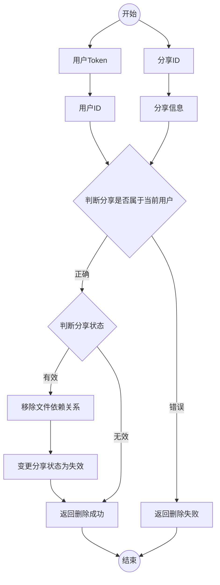
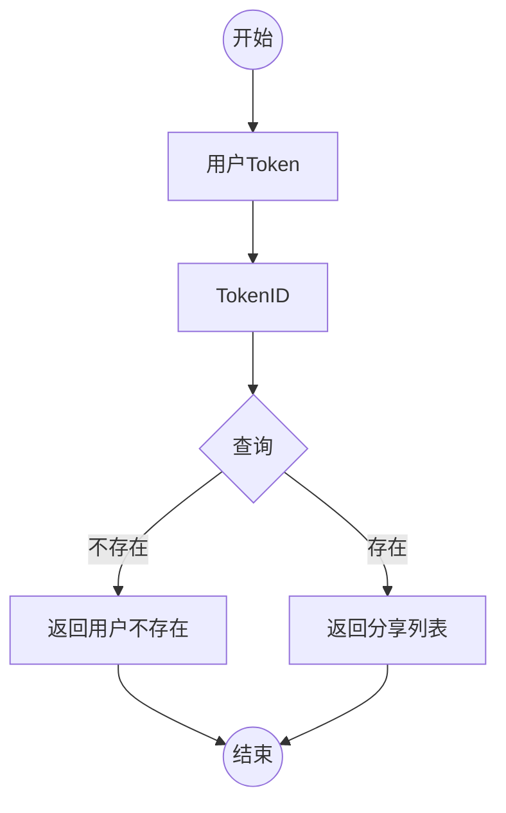
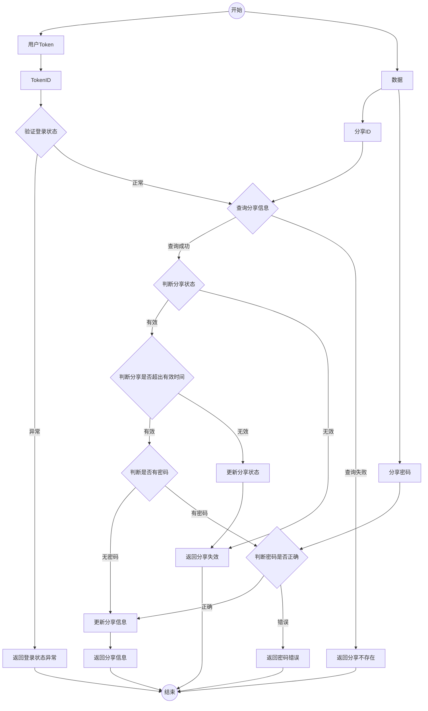
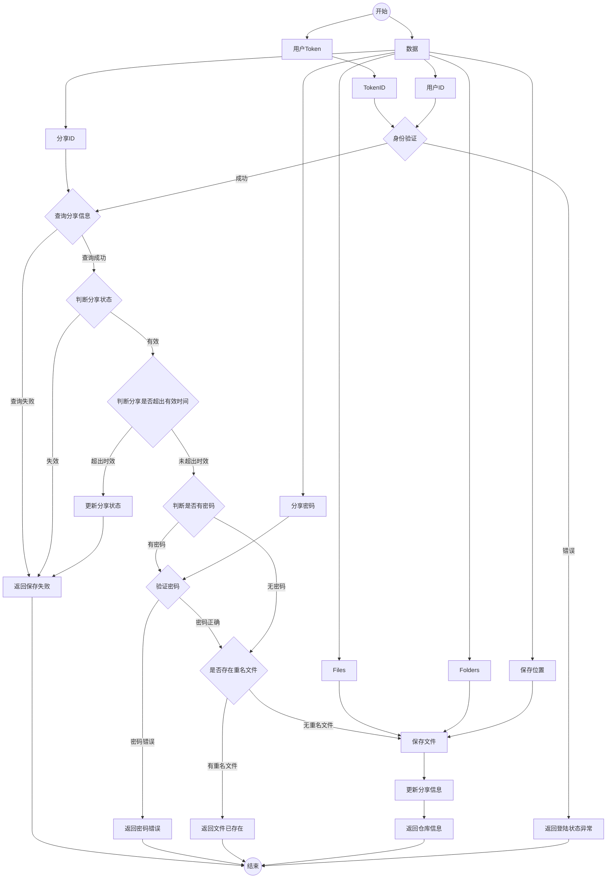
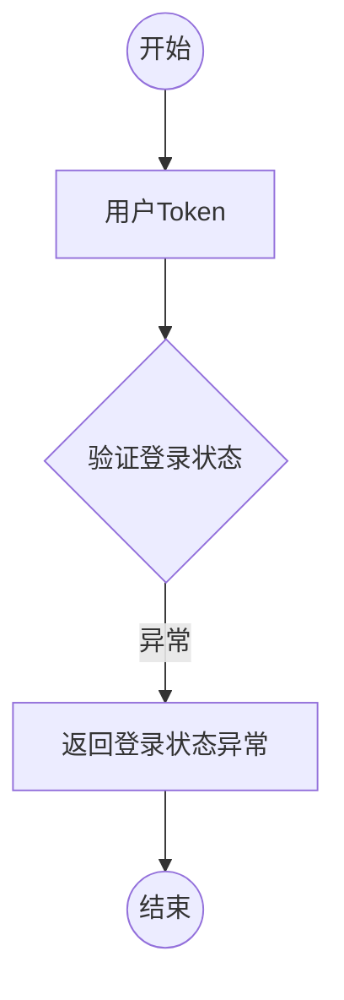

## 分享功能

### 创建分享

~~~mermaid
graph TD
	start((开始))-->用户Token-->TokenID
	start-->数据
	数据-->用户ID
	数据-->Files
	数据-->Folders
	数据-->分享名称-->创建分享
	数据-->分享密码-->创建分享
	数据-->失效时间-->创建分享
   	TokenID-->j1{身份验证}
   	用户ID-->j1
   	j1--错误-->返回创建失败-->finish((结束))
   	j2--异常-->返回创建失败
   	Files-->j2{判断文件状态}--正常-->遍历添加文件依赖关系并重构文件路径-->创建分享
   	Folders-->j2{判断文件状态}
   	j1--成功-->创建分享-->返回分享信息-->finish
   	
   
   
   
   
~~~

### 删除分享

### 查看个人分享

### 查看他人分享

### 保存他人分享

### 举报他人分享 TODO

### 下载分享 TODO

